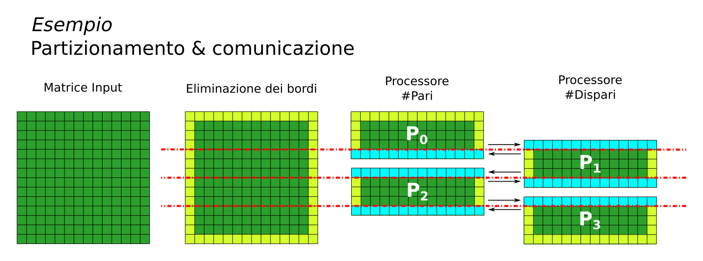
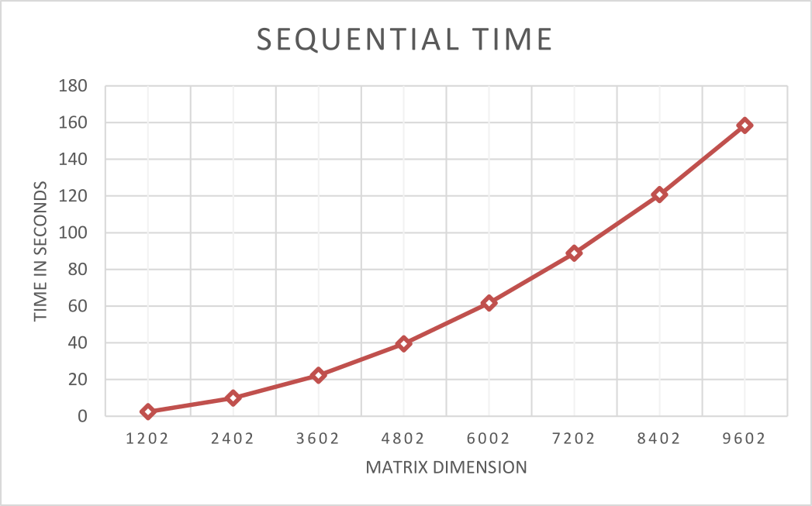
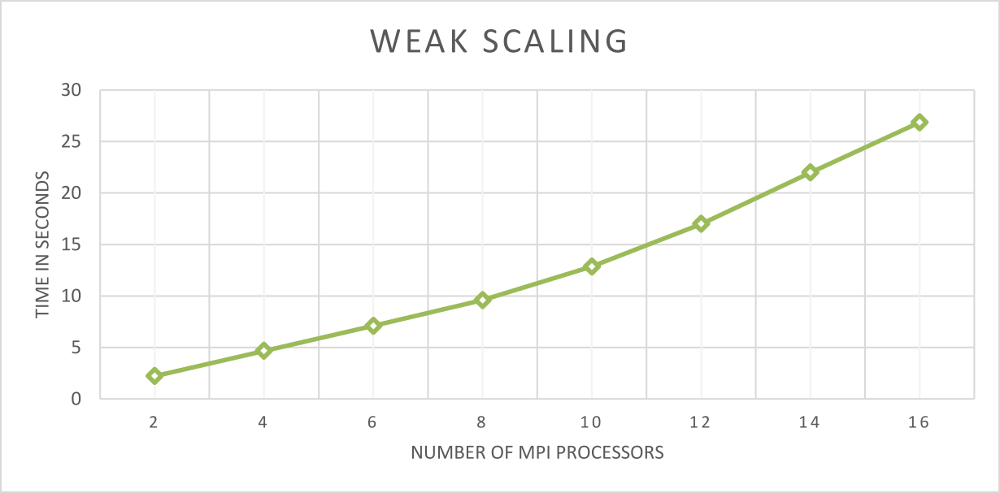
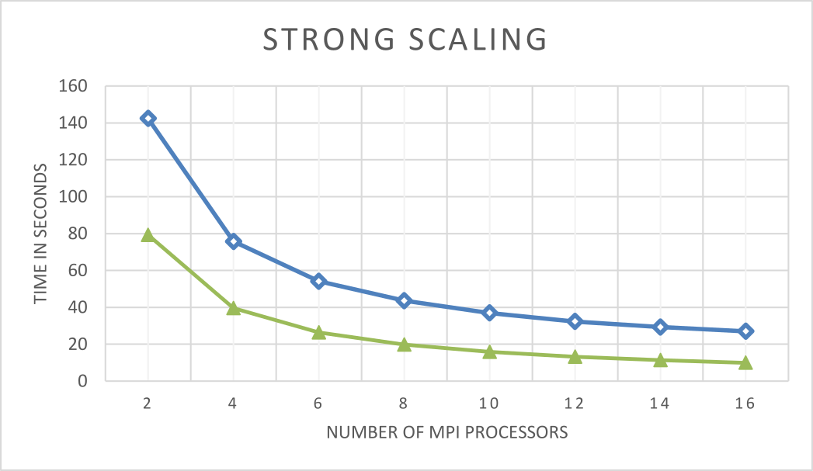
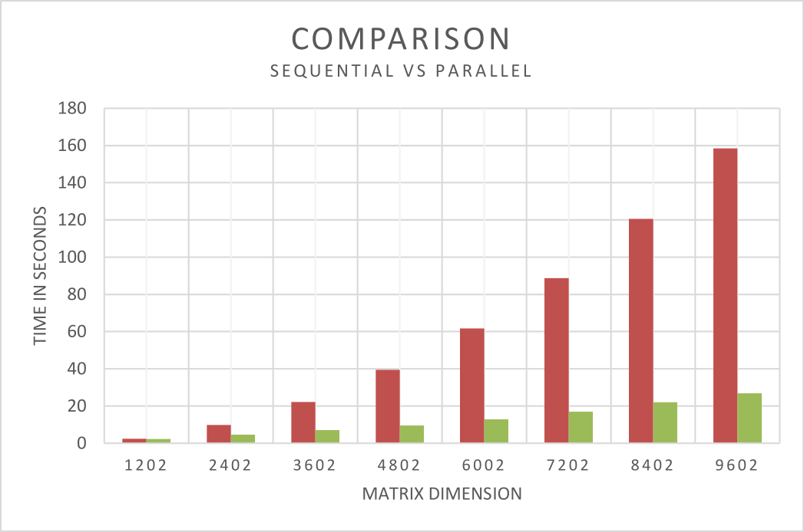

# A Simple Jacobi Iteration

Si propone un algoritmo che implementa l'iterazione di Jacobi per la risoluzione di un sistema lineare mediante MPI utilizzando connessioni Point-to-Point su istanze di tipo M4.Large di Amazon Web Service

## Problem Statement

In questo progetto si implementa una semplice iterazione di Jacobi per approssimare la soluzione di un sistema lineare di equazioni. Si risolve l'equazione di Laplace in due dimensioni con le differenze finite.
Per semplicità non considereremo i valori limite della matrice che quindi risulteranno invariati.

## Sviluppo

### Premesse

Prima di spiegare l'esecuzione del codice facciamo alcune premesse:

- Il dataset, nel caso le matrici, sono generate e salvate su file mediante il programma *JacobiGen*.
  La riga del file corrisponde alla riga della matrice ed ogni elemento della riga corrispondente è separata da uno spazio.
  Non sono generate durante l'esecuzione del programma ma caricate in maniera opportuna.

- Il caricamento da file della matrice non è preso in considerazione nel benchmark, ma viene opportunamente evitato (mediante l'uso di barriere *MPI_Barrier* ).

- Il partizionamento delle matrici è orizzontale.
  Ogni nodo quindi lavora su una parte della matrice, cioè su determinate righe di essa.

- Durante l'esecuzione ogni nodo partecipa alla computazione, compreso il master.

### Analisi Algoritmo Sequenziale

L'algoritmo sequenziale è basato sullo pseudocodice presentato nella descrizione del progetto.

Dopo aver caricato tutta la matrice da file vengono eseguite un massimo di 100 iterazioni entro le quali si computa l'approssimazione per la soluzione dell'equazione di Laplace.
Durante ogni iterazione viene eseguito il test convergenza: se la differenza parziale è inferiore a 1.0e-2 allora l'esecuzione termina prima.


### Analisi Algoritmo parallelo

Prima di iniziare l'esecuzione si controlla il numero di processori presenti nell'ambiente MPI : nel caso in cui ce ne fosse solamente uno il programma termina in quanto si considera non indispensabile usare MPI per un test sequenziale.

Successivamente viene gestito il partizionamento orizzontale della matrice : in base al numero di processori presenti ognuno di essi carica equamente lo stesso numero di righe da computare, a meno di reminder.
Poiché le matrici vengono caricate da file, durante questa fase sono anche determinati gli offset per il caricamento (e dunque cronometrati nel benchmark).

A questo punto tutti i processori computano l'approssimazione per la soluzione dell'equazione di Laplace mettendo i risulati in una matrice newMatrix per un numero massimo di volte pari a 100.

Alla fine di ogni iterazione ogni processore esegue il test di convergenza sulla propria sottomatrice e spedisce al master la propria differenza parziale.
A questo punto tutti gli slave sono in attesa del responso del master il quale, in base al calcolo della somma totale delle differenze parziali, invia un messaggio per informare se continuare o meno la computazione.
Nel caso in cui la differenza è superiore a 1.0e-2 allora informa gli slave di continuare la computazione altrimenti li informa di fermarsi.
Per l'invio di questo responso si è scelto l'uso di una comunicazione broadcast al posto di una comunicazione point-to-point in quanto sembrava per natura del problema più opportuna.

Durante ogni iterazione i nodi si scambiano le righe adiacenti (ghost):

- *ogni nodo-i invia/riceve la riga superiore/inferiore a/da il nodo precedente*
- *ogni nodo-i invia/riceve la riga inferiore/superiore a/da il nodo successivo*



Tutto ciò avviene creando una asimmetria sulla parità del rank del processore.

Al termine delle iterazioni il master riceve tutte le righe computate dagli slave (eccetto i ghost) riunendo quindi i risultati in una matrice *result_matrix*.


### Compilazione ed Esecuzione

Per eseguire il test in locale, dopo aver estratto il progetto eseguire i seguenti comandi:

```bash
cd src
make clean
make all
``` 

Il risultato della compilazione saranno i seguenti eseguibili (copiati anche nella root del progetto):

- **JacobiGen** -- Programma sequenziale che genera il dataset
- **JacobiSeq** -- Versione sequenziale dell'algoritmo (senza MPI)
- **JacobiPar** -- Versione parallela dell'algoritmo (che usa MPI)

A questo punto bisogna generare il dataset quindi bisogna tornare nella root del progetto e lanciare il seguente comando:

```bash
./JacobiGen
```

Le matrici generate saranno presenti nella directory "data".

Per lanciare la versione sequenziale dare il comando:

```bash
./JacobiSeq <DIM_MATRIX> <INPUT_FILE>
```

- *DIM_MATRIX* è un intero che rappresenta il numero di righe/colonne presenti nella matrice in input (che per definizione del problema è quadrata)
- *INPUT_FILE* invece è il percorso della del file da caricare, nel caso un file presente nella cartella "data"

Per eseguire la versione parallela dare invece il seguente comando:

```bash
mpirun -np <NUM_PROC> --hostfile <HOSTFILE> JacobiPar <DIM_MATRIX> <INPUT_FILE>
```

- *NUM_PROC* rappresenta il numero di processi MPI da lanciare
- *HOSTFILE* è il file contenente tutti gli ip privati che partecipano alla computazione in base al numero di processori NUM_PROC inserito; sono generati prima dell'avvio del benchmark.

Nel caso in cui si voglia testare invece la versione parallela in locale basta evitare l'opzione *--hostfile* quindi nel seguente modo: 

```bash
mpirun -np <NUM_PROC> JacobiPar <DIM_MATRIX> <INPUT_FILE>
```


## Esecuzione del Benchmark

Questo benchmark è stato eseguito su un cluster di istanze di tipo M4.Large di Amazon Web Service usando StarCluster AMI ami-52a0c53b (Linux Ubuntu).

Tutta la parte inziale di compilazione dei codici, della creazione del dataset e la spedizione di essi a tutti gli slave è affidata alla script *init.sh* mentre per l'esecuzione del benchmark è stata creata un'apposita suite sia per il sequenziale che per il parallelo.
Mostreremo comunque la modalità e le scelte prese per definire l'esperimento.

La suite di benchmark *benchmark.sh* dapprima esegue il benchmark sequenziale mediante lo script *seq_benchmark.sh*, poi quello parallelo con lo script *par_benchmark.sh* memorizzando tutti i risultati su un file *benchmark.dat* il quale verrà poi analizzato in locale.

**NOTA** -- Lo script *benchmark.sh* dipende da un file **ip_private_list.array** creato dal tool di creazione del cluster [AWS Build Cluster Script](https://github.com/isislab-unisa/aws-build-cluster-script) in cui sono presenti gli ip privati del cluster. 
Ad ogni modo, onde evitare possibili disguidi, sono presenti i sorgenti ed utilizzare usare opportuni hostfile.

### Weak Scaling

Nella fase di weak scaling è stato testato il programma parallelo utilizzando matrici variabili in base al numero di processori, ma mantenendo costate il numero di righe da computare per ogni processore, nel caso di taglia 600 righe.

| #IstanzeNelCluster | M4.Large #vCPU |  Dimensione Matrice  |
|:------------------:|:--------------:|:--------------------:|
|          1         |        2       |  (600*2)+2 = 1202    |
|          2         |        4       |  (600*4)+2 = 2402    |
|          3         |        6       |  (600*6)+2 = 3602    |
|          4         |        8       |  (600*8)+2 = 4802    |
|          5         |       10       |  (600*10)+2 = 6002   |
|          6         |       12       |  (600*12)+2 = 7202   |
|          7         |       14       |  (600*14)+2 = 8402   |
|          8         |       16       |  (600*16)+2 = 9602   |

Dunque per ogni istanza aggiunta nel cluster si avvia il programma parallelo aggiungendo 2 processi e prendendo la matrice di dimesione associata, generata precedentemente secondo questi criteri dal programma *JacobiGen*.

### Strong Scaling

Nella fase di strong scaling è stato testato il programma parallelo utilizzando una matrice con taglia massima 9602x9602, variando solamente il numero di istanze nel cluster e conseguentemente di processori.

### Sequencial Time

Per analizzare i tempi di esecuzione del sequenziale viene eseguito il programma sequenziale su tutte le matrici del dataset create.
Sono quindi memorizzati tutti i tempi e messi a confronto con il parallelo.


## Risultati del Benchmark

### Sequencial Time

<center>

</center>

|     Dim. Matrice   |        Tempo (S)     |
|:------------------:|:--------------------:|
|        1202        |       2.215012       |
|        2402        |       4.660212       |
|        3602        |       7.091276       |
|        4802        |       9.585205       |
|        6002        |       12.847208      |
|        7202        |       16.994764      |
|        8402        |       21.982195      |
|        9602        |       26.863352      |


### Weak Scaling

<center>

</center>

|      #Istanze      |   #Processori  |        Tempo (S)     |
|:------------------:|:--------------:|:--------------------:|
|          1         |        2       |       2.215012       |
|          2         |        4       |       4.660212       |
|          3         |        6       |       7.091276       |
|          4         |        8       |       9.585205       |
|          5         |       10       |       12.847208      |
|          6         |       12       |       16.994764      |
|          7         |       14       |       21.982195      |
|          8         |       16       |       26.863352      |


Come si può notare pur avendo fissato il lavoro per ogni processore all'aumentare delle istanze, e quindi dei processori, il tempo di esecuzione del programma aumenta: ciò è dovuto a problemi di comunicazione tra i processori ed ovviamente anche alla rete.


### Strong Scaling

<center>

</center>

|      #Istanze      |   #Processori  |       Tempo (S)      |    Tempo Ideale (S)  |
|:------------------:|:--------------:|:--------------------:|:--------------------:|
|          1         |        2       |       142.32933      |       79.2300        |
|          2         |        4       |       75.664817      |       39.6150        |
|          3         |        6       |       54.112059      |       26.4100        |
|          4         |        8       |       43.564758      |       19.8075        |
|          5         |       10       |       36.918753      |       15.8460        |
|          6         |       12       |       32.310789      |       13.2050        |
|          7         |       14       |       29.302926      |       11.3186        |
|          8         |       16       |       26.977674      |       9.9038         |


Come si può notare che pure avendo fissato la grandezza della matrice all'aumentare delle istanze, e quindi dei processori, il tempo di esecuzione del programma diminuisce sempre più.

Nel grafico viene tracciata anche il tempo ideale di computazione parallela: questo tempo è stato calcolato prendendo il tempo di esecuzione sequenziale e dividendolo per il numero di processori in uso nella corrispettiva esecuzione.
Come si può notare minore è il numero di processore e maggiore è il tempo di esecuzione reale rispetto a quello ideale.


### Confronto Sequenziale/Parallelo

Nel seguente grafico è messo a confronto il tempo sequenziale rispetto al relativo tempo parallello fissando il numero di istanze e processori in maniera tale da rendere fisso lo stesso carico di lavoro per ogni processore (in altre parole le misurazioni della weak scalability).

<center>

</center>

## Author

Questo progetto è stato realizzato da Sergio Guastaferro durante il corso di Programmazione Concorrente e Parallela su Cloud.